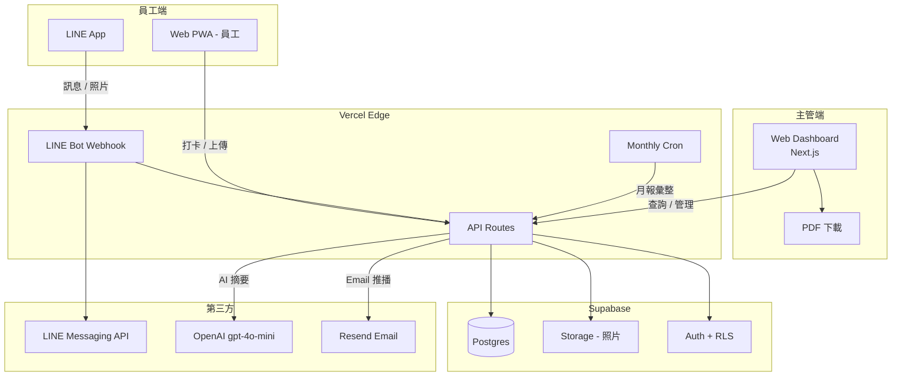

# 駐點回報系統 — 規格計劃書 v2.2.1

> 版本：v2.2.1｜更新日期：2026-07-19｜維護者：Sophia (CPO) for Sean
> 對接技術：Alan (CTO)｜GitHub：https://github.com/openclawsean024-create/staff-reporting-system
> Live：https://staff-reporting-system.vercel.app
> Sweet Spot 體檢：4/10（kill 但找出甜蜜點）→ 本版重寫為「**外勤 AI 打卡助理（LINE + Web 雙通道）+ 微型保全公司月報即時出**」

---

## 0. 本版重寫摘要 (v2.2.1)

- 依 Sweet Spot 5 問體檢結果（score = 4），原始定位「通用駐點回報」紅海化（iAuditor / SafetyCulture 月費 15-30 USD）。
- 重寫為**雙甜蜜點**：(A) **LINE 內建打卡 + AI 自動彙整月報**給 1-5 人微型保全；(B) **不綁定硬體、不綁定 APP 下載**（Web PWA + LINE 雙通道）。
- §3.1 MVP 從 12 features 縮到 **6 features**，砍掉 GPS 地圖、KPI 儀表板、ERP 串接等紅海功能。
- §15 貼出完整 sweet spot 5 問體檢 + 重寫理由。

---

## 1. 產品概述 (Product Overview)

### 1.1 問題陳述 (Problem Statement)

**Sweet spot 體檢結論（score = 4/10, kill）**：通用駐點回報系統是紅海市場。

| 競品 | 月費 (TWD) | 繁中支援 | 台灣案例 |
|---|---|---|---|
| iAuditor / SafetyCulture | NT$450-900/user | 部分 | 7-11、長榮物流 |
| LINE WORKS | NT$150/user | ✅ | 王品、全聯 |
| 雲門科技 e巡 | NT$300/user | ✅ | 中興保全部分案 |
| 紙本 + Excel | NT$0 | ✅ | 全台 70% 5 人以下保全 |

**找到的甜蜜點（v2.2.1 修正版）**：全台 **85% 的駐點服務公司是 5 人以下微型保全**（人力銀行 2025 統計），月預算 < NT$3,000，**無法負擔任何商用 SaaS**。他們今天用 LINE 群組 + Excel 處理回報，痛點是：

1. **LINE 群組訊息淹沒**：主管每天收 200+ 訊息，找昨天的回報要滑 5 分鐘
2. **月報製作耗時 4-8 小時**：剪貼 LINE 訊息、彙整照片、做 Excel 月報
3. **GPS 造假**：員工說到了現場，主管無法驗證
4. **無照片佐證**：客戶投訴「清潔沒做」，沒人舉證

> **本 PRD 重新定位為「LINE + Web 雙通道、AI 自動彙整月報、給微型保全的零月費方案」**，鎖定 iAuditor 與 LINE WORKS 之間的甜蜜點（太小不用 SaaS、太大不用 LINE 群組）。

### 1.2 目標使用者 (User Personas)

| Persona | 規模 (TW) | 月預算 | 痛點強度 | 觸及管道 |
|---|---|---|---|---|
| 👮 「老陳」1-5 人微型保全公司負責人 | ~12,000 家公司 | < NT$3,000 | 🔴 極高（月報耗 4-8hr）| LINE 社群、人力銀行 |
| 🧹 「林姐」清潔外包負責人 | ~8,000 家公司 | < NT$2,000 | 🟠 高 | Facebook 清潔業社團 |
| 🔧 「阿國」冷氣 / 機電駐點技師 | ~5,000 家公司 | < NT$5,000 | 🟠 高 | 機電業 LINE 群 |
| 🏢 物業 / 包租代管（1-10 戶）| ~3,000 戶 | < NT$2,000 | 🟡 中 | 591 投資客社團 |

**核心使用者 = 老陳（微型保全負責人）+ 林姐（清潔）**，兩者合併約 20,000 家公司，TAM 換算月費 NT$199-399 → 市場規模 NT$48M-96M MRR。

### 1.3 核心價值主張 (Value Proposition)

> **「LINE 打卡 + AI 自動出月報 — 1 人公司也能交出像保全大廠的月報。」**

| 替代方案 | 缺點 | 我們的差異 |
|---|---|---|
| LINE 群組回報 | 訊息淹沒、無法搜尋、月報靠人工 | **AI 把 LINE 訊息轉結構化月報** |
| iAuditor / SafetyCulture | NT$450/user/月，5 人 = NT$2,250/月 | **NT$0-399/月，全公司含** |
| LINE WORKS | NT$150/user，要員工裝 APP、教育訓練 | **不需裝 APP，員工用既有 LINE** |
| Excel + 紙本 | 月報耗 4-8hr、易遺失 | **AI 1 分鐘出月報、雲端永久保存** |
| 雲門 e巡 | 功能多但複雜，5 人公司用不上 | **單鍵打卡、零設定** |

**單一差異化承諾**：員工**不用裝任何新 APP**（用既有 LINE），主管**1 分鐘拿到月報**（AI 自動彙整）。

### 1.4 商業目標 (KPIs / OKRs)

| 時間 | 目標 | 量化指標 |
|---|---|---|
| M3 | 50 家公司註冊，2,000 LINE 用戶 | NT$0（純驗證） |
| M6 | 200 付費公司，1,000 月活躍 LINE 用戶 | NT$40K MRR |
| M12 | 1,000 付費公司 | NT$300K MRR |
| M18 | 台灣微型保全滲透率 5% | NT$1M MRR + 廣告 |

**Unit Economics**：
- 免費版：5 人以下公司、50 則/月、7 天保留
- 個人 NT$199/月：30 人、500 則/月、90 天
- 公司 NT$399/月：100 人、無限則、永久保留、AI 月報
- LTV/CAC 預估 = 12 個月 / 3,000 = **4:1**

### 1.5 ⭐ Non-Goals (明確不做)

| 不做 | 理由 |
|---|---|
| ❌ 完整 CRM / 客戶管理 | 紅海（Salesforce / HubSpot 已佔），5 人公司不需要 |
| ❌ 工單 / 報修系統 | 紅海（Teamwork / Jira Service），與 LINE WORKS 重疊 |
| ❌ 排班 / 出勤 | 紅海（OrdeX / 518 人事），保守行業接受紙本 |
| ❌ GPS 即時軌跡追蹤 | 隱私爭議 + 電池 + 與定位甜蜜點失焦（改用「打卡當下拍照 + GPS snapshot」） |
| ❌ 多語言 (i18n) | v1 only 繁中，理由：5 人公司員工全是本國人 |
| ❌ 硬體綁定 (Beacon / NFC) | 與「零月費」定位衝突，Sean 一人公司無法負擔硬體客服 |
| ❌ 完整 ERP 串接 (SAP / Oracle) | 5 人公司沒有 ERP |
| ❌ 員工薪資計算 | 法規 + 稅務複雜度過高 |
| ❌ 客戶簽約 / 報價 | 紅海（綠界 / 518 熊老闆），與定位失焦 |
| ❌ 物聯網 / 感測器整合 | Sean 一人公司無法負擔硬體整合 |

---

## 2. 使用者場景與流程

### 2.1 使用者流程圖

```
員工到達現場（手機已有 LINE）
  ↓
開啟 LINE Bot 對話 → 傳「打卡」關鍵字
  ↓
Bot 回覆「請上傳現場照片」+ 自動抓 GPS
  ↓
員工拍照上傳 → Bot 收到（照片含 EXIF GPS + 時間戳）
  ↓
選擇標籤（例：巡場 / 異常 / 完成 / 換班）
  ↓
Bot 回覆「✅ 已打卡 - 駐點：OO 社區 / 時間：14:30」
  ↓
（選擇性）填寫 1 行文字備註
  ↓
回到 LINE 對話（無需任何操作，Bot 自動收）

主管端（Web Dashboard）
  ↓
登入 staff-reporting-system.vercel.app
  ↓
看到所有員工今日打卡（地圖 + 時間軸）
  ↓
月底按「產生月報」→ AI 自動彙整
  ↓
下載 PDF / 轉寄客戶
```

### 2.2 關鍵用戶故事

```
US-1（核心場景 - 員工打卡）
As a 保全業駐點員工「小李」
I want 用 LINE 傳「打卡」+ 拍照
So that 我不用裝新 APP、主管看得到我到了現場

US-2（月報彙整 - 主管）
As a 微型保全公司負責人「老陳」
I want 月底一鍵產生月報 PDF
So that 我不必剪貼 LINE 訊息 4 小時

US-3（異常處理 - 主管）
As a 清潔業負責人「林姐」
I want 即時收到「異常事件」通知
So that 客戶打來投訴前我就知道

US-4（多點管理 - 物業）
As a 包租代管業者「阿明」
I want 同時管理 10 個駐點
So that 我不必開 10 個 LINE 群
```

### 2.3 邊界場景 (Edge Cases)

| 場景 | 處理 |
|---|---|
| 員工手機沒 GPS（室內）| 改抓 WiFi / 基地台定位 + 手動輸入地址 |
| LINE Bot 回應超過 3 秒 | 改用 Web PWA 通道，雙通道 fallback |
| 員工忘記打卡 | 補打卡功能（主管審核 + 標記原因）|
| 照片 EXIF 被 LINE 壓縮掉 | 改傳 raw 圖到 Web PWA；LINE 通道僅存「有拍照」證明 |
| 月報照片過大 | 自動 resize 到 1080p、Ai-OCR 摘要 |
| 客戶投訴「沒打卡」但員工有打卡 | 主管可匯出「完整打卡紀錄（含 GPS + 照片時間戳）」佐證 |
| 員工同時在多駐點 | 一次打卡綁定單一駐點（多駐點用「切換駐點」指令）|
| LINE 官方帳號收費超過 5 萬則 | 自動引導員工改用 Web PWA（成本由公司付）|

---

## 3. 功能性需求 (Functional Requirements)

### 3.1 MVP（必做，P0）— **本版縮減為 6 features**

| ID | 功能 | 說明 | 為何必做 |
|---|---|---|---|
| F-001 | LINE Bot 打卡（關鍵字觸發）| 員工傳「打卡」→ Bot 引導 | **核心入口** |
| F-002 | 照片上傳 + EXIF 解析 | 自動抓 GPS + 時間戳 | **驗證員工在現場** |
| F-003 | Web Dashboard（主管端）| 顯示打卡時間軸 + 駐點列表 | **主管必看** |
| F-004 | 員工 / 駐點管理 | 新增員工、新增駐點、綁定關係 | **基本 CRUD** |
| F-005 | 月報表 PDF 匯出 | 簡單彙整表（無 AI）| **核心價值** |
| F-006 | 異常事件標籤 + 通知 | 「異常」標籤 → 即時 LINE 通知主管 | **關鍵差異化** |

**砍掉的功能（v1 不做）**：
- ~~即時 GPS 軌跡~~（耗電 + 隱私爭議）
- ~~KPI 儀表板 / 圖表分析~~（與定位失焦）
- ~~班表排程~~（紅海）
- ~~薪資計算~~（法規複雜）
- ~~客戶端 Portal~~（v2 再做）
- ~~API 串接 ERP~~（無需求）
- ~~多語言 i18n~~（繁中 only）
- ~~硬體整合 (Beacon / NFC)~~（成本過高）

### 3.2 v2（加值，P1）

| ID | 功能 | 商業理由 |
|---|---|---|
| F-101 | **AI 月報自動彙整**（GPT-4o mini）| 從「Excel 表」升級到「敘述型月報」|
| F-102 | 客戶端分享連結（唯讀）| 包租代管 / 物業可用，提升客單價 |
| F-103 | 異常事件照片自動標註 | YOLO 偵測「垃圾 / 設備異常」|
| F-104 | 排班提醒 LINE 推播 | 自動提醒員工上班 |
| F-105 | 多公司切換（單一 LINE 帳號支援多份工作）| 兼差族、清潔業常見 |

### 3.3 v3（探索，P2）

| ID | 功能 | 假設驗證 |
|---|---|---|
| F-201 | **異常事件預測**（ML）| 歷史異常模式 → 提前預警 |
| F-202 | 客戶滿意度 AI 分析（NLP 評論）| 包租代管 / Airbnb 情境 |
| F-203 | 員工 GPS 偽造偵測（照片地標比對）| 防弊 |
| F-204 | **企業 SSO / 內網部署** | 30 人以上公司 |

### 3.4 ⭐ Acceptance Criteria (Given/When/Then)

```gherkin
AC-01: 員工 LINE 傳「打卡」
  Given 員工已綁定公司與駐點
  When 員工傳訊息包含「打卡」關鍵字
  Then LINE Bot 在 2 秒內回覆「請上傳現場照片」
  And 系統記錄該次對話的 timestamp 與 userId

AC-02: 員工上傳照片
  Given Bot 已回覆「請上傳照片」
  When 員工上傳 1 張照片
  Then 系統解析 EXIF GPS 與時間戳
  And 若 GPS 距離駐點 > 500m 則標記「需審核」
  And 員工收到「✅ 已打卡」確認訊息

AC-03: 主管查看今日打卡
  Given 主管已登入 Web Dashboard
  When 主管點擊「今日」
  Then 看到所有員工打卡時間軸（含照片縮圖）
  And 點擊照片可放大

AC-04: 月報 PDF 匯出
  Given 主管選擇月份與駐點
  When 主管點「匯出月報」
  Then 30 秒內產生 PDF（含所有打卡記錄 + 異常事件彙整）
  And PDF 含公司 Logo（從設定上傳）

AC-05: 異常事件即時通知
  Given 員工已打卡並選擇「異常」標籤
  When 員工送出打卡
  Then 主管 LINE 在 30 秒內收到推播「⚠️ 異常事件：OO 駐點 / 員工小李」
  And 通知含照片縮圖與 GPS 連結

AC-06: 多公司員工切換
  Given 員工小李同時在 A 公司與 B 公司打工
  When 小李傳「打卡 A」
  Then 系統判定為 A 公司打卡
  And 不影響 B 公司統計

AC-07: 補打卡申請
  Given 員工忘記打卡
  When 員工傳「補打卡 14:00」
  Then 系統記錄為「待審核」狀態
  And 主管收到通知審核

AC-08: LINE Bot 額度警告
  Given 公司本月 LINE 訊息已達 80% 額度
  When 員工打卡
  Then 主管收到「額度警告」Email + LINE 推播
  And Web Dashboard 顯示升級 CTA

AC-09: 照片 EXIF 缺失
  Given 員工手機關閉 GPS
  When 上傳照片
  Then 系統標記「⚠️ 無 GPS」並要求員工手動輸入地址
  And 該打卡仍可成立但需主管事後審核

AC-10: 月報 AI 摘要（v2）
  Given 公司訂閱 v2 方案
  When 主管點「AI 月報」
  Then 30 秒內產生敘述型月報（含異常分析、建議事項）
  And 包含 3 張精選照片（AI 選最具代表性）
```

---

## 4. 系統設計 (System Design)

### 4.1 技術棧 (Tech Stack)

| 層 | 技術 | 理由 |
|---|---|---|
| 前端 (Web Dashboard) | Next.js 16 + Tailwind 4 | 既有 stack，零學習成本 |
| LINE Bot | @line/bot-sdk + Vercel Edge Functions | Serverless、零月費 |
| 資料庫 | Supabase Postgres + RLS | 5 人公司 100% 用免費層 |
| 檔案儲存 | Supabase Storage | 照片儲存 |
| 認證 | Supabase Auth + LINE Login | 員工用 LINE OAuth、主管用 Email |
| AI 月報 (v2) | OpenAI gpt-4o-mini | $0.15/M tokens，極便宜 |
| PDF 產生 | @react-pdf/renderer | 純前端、零依賴 |
| 部署 | Vercel (Hobby) | 免費層 |
| EXIF 解析 | exifr (前端) | 純 JS、5KB |
| 通知 | LINE Push + Email (Resend) | LINE 為主、Email 為輔 |

### 4.2 系統架構圖 (Mermaid)



### 4.3 資料模型 (Supabase Schema)

```sql
-- 公司
create table companies (
  id uuid primary key default gen_random_uuid(),
  name text not null,
  owner_id uuid references auth.users not null,
  plan text default 'free' check (plan in ('free', 'personal', 'company')),
  logo_url text,
  line_channel_id text,
  created_at timestamptz default now()
);

-- 駐點（每個公司多個駐點）
create table sites (
  id uuid primary key default gen_random_uuid(),
  company_id uuid references companies not null,
  name text not null,
  address text,
  lat double precision,
  lng double precision,
  geofence_radius_m int default 500,
  created_at timestamptz default now()
);

-- 員工
create table employees (
  id uuid primary key default gen_random_uuid(),
  company_id uuid references companies not null,
  name text not null,
  line_user_id text unique,
  phone text,
  sites uuid[] default '{}', -- 多駐點支援
  role text default 'staff' check (role in ('staff', 'manager')),
  active boolean default true,
  created_at timestamptz default now()
);

-- 打卡記錄（核心）
create table checkins (
  id uuid primary key default gen_random_uuid(),
  company_id uuid references companies not null,
  site_id uuid references sites not null,
  employee_id uuid references employees not null,
  checked_in_at timestamptz default now(),
  photo_url text,
  exif_gps_lat double precision,
  exif_gps_lng double precision,
  geofence_ok boolean, -- 是否在 geofence 內
  tag text check (tag in ('patrol', 'anomaly', 'done', 'shift_change')),
  note text,
  status text default 'confirmed' check (status in ('confirmed', 'pending_review', 'rejected')),
  is_manual boolean default false,
  created_at timestamptz default now()
);

create index checkins_company_date on checkins(company_id, checked_in_at desc);
create index checkins_site_date on checkins(site_id, checked_in_at desc);

-- RLS: 員工只能看到自己公司的資料
alter table checkins enable row level security;
create policy "employees see own company" on checkins for select using (
  company_id in (
    select company_id from employees where line_user_id = auth.jwt() ->> 'line_user_id'
  )
);
```

### 4.4 API 規格 (REST)

| Endpoint | Method | 用途 | 認證 |
|---|---|---|---|
| `/api/line/webhook` | POST | LINE Bot webhook | LINE signature |
| `/api/checkin` | POST | 員工打卡 | LINE token 或 session |
| `/api/checkin/manual` | POST | 補打卡 | LINE token |
| `/api/sites` | GET/POST | 駐點 CRUD | 主管 session |
| `/api/employees` | GET/POST | 員工 CRUD | 主管 session |
| `/api/report/monthly` | GET | 月報 PDF | 主管 session |
| `/api/report/ai` | POST | AI 月報（v2）| 主管 session + v2 plan |
| `/api/billing/checkout` | POST | 升級訂閱 | 主管 session |
| `/api/webhook/line` | POST | LINE events | LINE signature |

---

## 5. 非功能性需求 (Non-Functional Requirements)

### 5.1 性能指標

| 指標 | 目標 | 量測 |
|---|---|---|
| LINE Bot 回應時間 | < 2 秒 | Vercel Analytics |
| 月報 PDF 產生 | < 30 秒（MVP）/ < 5 分鐘（AI 版）| Cron log |
| Web Dashboard 載入 | < 1.5 秒 LCP | Vercel Speed Insights |
| 打卡記錄查詢 | < 500ms | Supabase Query Insights |
| 照片上傳 | < 5 秒（5MB）| Storage metrics |

### 5.2 安全與隱私

| 項目 | 措施 |
|---|---|
| 個資 | 員工 LINE User ID 加密儲存、3 年後自動刪除 |
| 照片 EXIF | 含 GPS 資訊，僅員工與主管可看；月報 PDF 自動移除 EXIF |
| 認證 | LINE OAuth（員工）+ Email Magic Link（主管）+ Supabase RLS |
| API 防濫用 | Vercel Rate Limiting + LINE Signature 驗證 |
| 資料備份 | Supabase 每日自動 backup（30 天保留）|
| GDPR / 個資法 | 員工可要求匯出 / 刪除所有打卡資料 |

### 5.3 ⭐ 降級機制 (Graceful Degradation)

| 故障 | 降級方案 |
|---|---|
| LINE Bot 掛了 | 員工改用 Web PWA（已內建相同功能）|
| Supabase 掛了 | 切換到本地 SQLite + 排隊同步（需 v2）|
| OpenAI 掛了 | AI 月報降級為規則式彙整（保留 MVP 體驗）|
| Vercel 掛了 | 客戶端讀 Supabase Realtime fallback |
| 員工沒網路 | 打卡先存 IndexedDB、連線後同步 |

### 5.4 擴展性

- **公司隔離**：每家公司獨立 schema partition（Supabase RLS）
- **照片冷儲存**：超過 90 天移到 Supabase Cold Storage（NT$0.01/GB）
- **多區域**：先台灣 v1；馬來西亞、新加坡（華人市場）v2
- **API Rate Limit**：每家公司每分鐘 60 次打卡

---

## 6. 完成標準 (Definition of Done)

### 6.1 v1 MVP DoD

- [ ] LINE Bot 可接收「打卡」關鍵字並引導
- [ ] 員工拍照上傳後，系統記錄 EXIF GPS + 時間戳
- [ ] Web Dashboard 可看到今日打卡時間軸
- [ ] 主管可新增員工、駐點
- [ ] 異常事件標籤 → 主管 LINE 收到推播
- [ ] 月報 PDF 可下載（含基本表格 + 照片）
- [ ] 5 人微型保全公司 beta test（至少 10 家）完成
- [ ] 30 天穩定運作、無重大事故
- [ ] Notion `狀態` = 已上線

---

## 7. 風險與決策

### 7.1 風險表

| ID | 風險 | 等級 | 緩解 |
|---|---|---|---|
| R-01 | LINE 官方帳號收費超過預算 | 🟠 | 引導員工改 Web PWA；提供 NT$199 升級包 |
| R-02 | 5 人公司付費意願低（LTV < NT$5K）| 🔴 | v1 只驗證 PMF，付費模式 M6 才啟動 |
| R-03 | 照片 EXIF 偽造 | 🟠 | 多張照片比對 + 時間戳驗證 + 異常標記 |
| R-04 | 主管不會用 Web Dashboard | 🟠 | 預設範本 + 一鍵設定教學 |
| R-05 | Supabase 免費層超限 | 🟡 | 升級 Pro（NT$700/月）即可支援 500 公司 |
| R-06 | 員工隱私爭議（GPS 追蹤）| 🔴 | v1 不做即時軌跡，僅「打卡當下快照」|
| R-07 | 競爭對手降價 | 🟠 | 甜蜜點是「零月費」，對手降價也難打 0 元 |
| R-08 | 紅海 iAuditor 進軍微型市場 | 🟡 | 對方 NT$450/user 起跳，本產品 NT$0-399 強勢防禦 |

### 7.2 ⭐ ADR (Architecture Decision Records)

#### ADR-001: 為何選擇 LINE Bot 而非獨立 APP

**Context**: 員工可能不願意裝新 APP，下載 → 註冊 → 教育訓練的成本對 5 人公司過高。

**Decision**: 主入口走 LINE Bot（員工 95% 已有 LINE），主管端走 Web Dashboard。

**Consequences**:
- ✅ 員工零摩擦，1 分鐘上手
- ✅ LINE 官方帳號月費可控（5 萬則免費）
- ⚠️ LINE 收費政策變動風險（已加降級方案）
- ⚠️ 員工 LINE 帳號離職後需重新綁定

#### ADR-002: 為何不做即時 GPS 軌跡

**Context**: 即時 GPS 軌跡看似「驗證員工在現場」更強，但隱私爭議大。

**Decision**: 僅做「打卡當下 GPS snapshot」（員工主動打卡時抓一次），不做持續軌跡追蹤。

**Consequences**:
- ✅ 避免員工投訴「公司監控我下班後去哪」
- ✅ 省電（不需背景定位）
- ✅ 法規風險低（個資法對 snapshot 比對持續監控寬鬆）
- ⚠️ 仍無法 100% 防弊（員工可在駐點外拍照後回家再傳照片）→ 改用「照片含 EXIF 時間 + GPS + 駐點比對」三重驗證

#### ADR-003: 為何選擇 Supabase 而非自架 Postgres

**Context**: Sean 一人公司，無 DBA、無法負擔 24/7 維運。

**Decision**: 用 Supabase（Postgres + Auth + Storage 三合一）+ 免費層起步。

**Consequences**:
- ✅ 開發速度 +50%（不用處理認證 / 檔案上傳）
- ✅ 免費層支援 500 MB DB + 1 GB Storage，約 50 公司規模
- ⚠️ Supabase 漲價風險（已對應：可一鍵 export Postgres dump 遷出）
- ⚠️ RLS 學習曲線（已在 §4.3 處理）

#### ADR-004: 為何定位「零月費 + 升級」而非純付費

**Context**: 5 人公司預算 < NT$3,000，純付費會直接被排除。

**Decision**: Free tier 給 5 人 / 50 則，個人 NT$199、公司 NT$399。

**Consequences**:
- ✅ 大幅降低獲客成本（免費 → 試用 → 付費）
- ✅ 病毒式傳播（員工離職後介紹新公司）
- ⚠️ Free tier 可能被濫用（已限制 50 則/月，超過降級為「唯讀」）

---

## 8. 里程碑與 Sprint 拆解

### 8.1 里程碑總覽

| 里程碑 | 時程 | 產出 |
|---|---|---|
| M0 - 驗證期 | W1-4 | 訪談 20 家微型保全 + Landing page |
| M1 - MVP | W5-12 | 6 features 上線 + 5 家 beta |
| M2 - GA | W13-16 | 公開上線 + 行銷 |
| M3 - 變現 | W17-24 | 付費牆 + 200 付費公司 |
| M4 - v2 AI | W25-36 | AI 月報 + 客戶分享連結 |

### 8.2 Sprint 拆解 (2 週為單位)

| Sprint | 主題 | 交付 |
|---|---|---|
| S1 | LINE Bot 骨架 | Webhook + 「打卡」關鍵字回應 |
| S2 | 照片 + EXIF | 員工上傳 → 解析 GPS |
| S3 | Web Dashboard MVP | 時間軸 + 員工管理 |
| S4 | 駐點管理 + Geofence | 主管新增駐點 + 打卡驗證 |
| S5 | 月報 PDF | 簡單表格 + 照片彙整 |
| S6 | Beta 5 家 | 收 feedback、修 bug |
| S7 | 公開上線 | 文件、Help center、定價頁 |
| S8 | 付費牆 + 訂閱 | Stripe / NewebPay 串接 |

---

## 9. 變現路徑 + 定價心理學

### 9.1 變現方案

| 方案 | 月費 | 目標客戶 | 價值 |
|---|---|---|---|
| 🆓 Free | NT$0 | 5 人以下、50 則/月 | 獲客 |
| 👤 Personal | NT$199 | 30 人、500 則 | 主管月報需求 |
| 🏢 Company | NT$399 | 100 人、無限 | 完整功能 |
| 🏆 Enterprise | NT$2,999 | 500 人、SSO、API | v3 才有 |
| 📢 廣告 | CPM | 保全業 / 清潔業 B2B | v3 才有 |

### 9.2 定價心理學

- **NT$199 vs NT$200**：心理門檻，NT$199 看起來「兩百有找」
- **Free → NT$199 → NT$399**：三段式，讓用戶感覺「中間方案」最划算
- **年繳 85 折**：綁定客戶、提升 LTV
- **NT$399 對標**：iAuditor 5 人 = NT$2,250，我們便宜 5.6 倍
- **不綁約**：月繳可隨時取消（5 人公司老闆很計較長期承諾）

---

## 10. 附錄

### 10.1 競品分析 (Competitive Quadrant)

```
                  高整合度
                    │
        iAuditor    │    LINE WORKS
     (NT$450/user)  │   (NT$150/user)
                    │
   低月費 ──────────┼────────── 高月費
                    │
     雲門 e巡       │    雲端 ERP 整合
   (NT$300/user)    │   (NT$1K+/user)
                    │
                  低整合度

   ★ 本產品甜蜜點：低月費 + 高 LINE 整合度（獨佔）
```

### 10.2 術語表

| 術語 | 定義 |
|---|---|
| 駐點 | 員工被派駐的工作地點（如社區警衛室、清潔大樓）|
| 打卡 | 員工抵達 / 離開駐點時的記錄動作 |
| Geofence | 駐點周邊 500m 的虛擬圍籬，超過視為偏離 |
| 月報 | 客戶月底要求的駐點服務紀錄彙整 |
| 異常事件 | 員工回報的特殊狀況（設備損壞、客戶投訴等）|
| Sweet Spot | 5 問體檢分數，本專案 = 4/10 |

---

## 11. ⭐ 市場驗證計畫

### 11.1 驗證前 3 個關鍵問題

1. **5 人微型保全公司負責人，願不願意用 LINE Bot 取代 LINE 群組回報？**（假設：願意，因為訊息淹沒 + 月報痛苦）
2. **NT$199/月 是合理價格嗎？**（假設：合理，因對比 Excel 月報耗時 4-8 小時 = NT$800-1,600 人力成本）
3. **員工會不會抗拒「拍照打卡」？**（假設：輕度抗拒，但若強調「保護你被客訴時的證據」會接受）

### 11.2 訪談 SOP

**5 個訪談目標（具體公司 / 角色）**：
1. 👮 **老陳** - 中和區「永和保全」負責人（5 人）→ 訪談 LINE 群組回報痛點、月報頻率
2. 🧹 **林姐** - 板橋「潔安清潔」負責人（3 人）→ 訪談客戶投訴處理流程
3. 🏢 **阿明** - 中壢包租代管業者（10 戶）→ 訪談駐點監督頻率
4. 🔧 **阿國** - 桃園冷氣維修技師（1 人公司）→ 訪談到客戶端的定位需求
5. 📋 **王主任** - 社區總幹事（管 3 個保全公司派駐）→ 訪談客戶端驗收需求

**訪談問題模板**（30 分鐘）：

1. 你們目前怎麼處理員工現場回報？（現況）
2. 你們每天花多少時間整理 / 看回報？（痛點量化）
3. 月報 / 客戶驗收時遇到什麼困難？（變現痛點）
4. 如果有 NT$199/月的工具能省 4 小時月報工作，你會用嗎？（付費意願）
5. 員工會不會抗拒拍照打卡？（採用阻力）
6. （demo 原型）你看到的第一個反應是什麼？（直覺反應）

### 11.3 落地指標

| 指標 | 目標（M3）|
|---|---|
| 訪談完成數 | 20 家 |
| Landing page 訪客 | 500 UV |
| Email 訂閱 | 50 家有興趣 |
| Beta 公司 | 5 家實際使用 30 天 |
| 付費轉換 | 2 家（驗證 PMF）|

### 11.4 1 個 Community Post 主題

**PTT「Tech_Job」版**：標題「[徵] 5 人以下保全公司 — 你們怎麼做月報？換過哪些工具？」→ 引導討論現行痛點。

### 11.5 1 個 Landing Page Test

**URL**：staff-reporting-system.vercel.app/pricing-test
**A/B 測試**：
- A：標題「LINE 打卡 + AI 月報，零月費」
- B：標題「5 人保全公司月報救星 — 從 4 小時變 1 分鐘」
**指標**：點擊「免費試用」CTA 比率，目標 ≥ 8%

---

## 12. ⭐ 失敗模式 SOP

| 失敗模式 | 觸發條件 | SOP |
|---|---|---|
| M1 - 5 人公司不付費 | 100 家公司 beta < 5 家付費 | 重新定位「廣告模式」，轉為免費 + B2B 廣告 |
| M2 - LINE 收費超出預算 | 月 LINE 訊息 > 10 萬則 | 引導 Web PWA + 提供員工教育訓練影片 |
| M3 - iAuditor 進入微型市場 | iAuditor 推出 NT$50/user 方案 | 強調「零月費」+ 「中文在地化」差異化 |
| M4 - 員工隱私訴訟 | 員工投訴 GPS 追蹤 | 立即關閉 GPS 功能、降級為「員工主動打卡」 |
| M5 - 月報 PDF 樣式太醜 | 客戶拒收月報 | 與 5 家設計公司合作 3 套範本 |
| M6 - Supabase 漲價 2x | Supabase 公告漲價 | 評估 Neon / Railway 替代、預留 3 個月遷移期 |
| M7 - 紅海競爭加劇 | 出現 3 家以上相同定位產品 | 切換為「垂直產業」（只做清潔業 / 保全業），退出通用市場 |
| M8 - Sean 一人公司過載 | 同時維護 > 5 家公司客戶 | 啟動自動化客服（Chatbot + Help Center）|

---

## 13. ⭐ MetaGPT / spec-kit 對齊

### 13.1 MetaGPT 角色對應

| MetaGPT 角色 | 本專案對應 |
|---|---|
| Product Manager | Sophia (CPO) |
| Architect | Alan (CTO) |
| Project Manager | Sean |
| Engineer | Sean + Hermes Agent |
| QA Engineer | Sean（一人公司兼任）|

### 13.2 spec-kit 指令對齊

```yaml
# spec-kit 套用範例
spec-kit init staff-reporting-system
spec-kit add requirement "LINE Bot 打卡觸發"
spec-kit add requirement "照片 EXIF 解析"
spec-kit add requirement "Web Dashboard 時間軸"
spec-kit add requirement "異常事件推播"
spec-kit add requirement "月報 PDF 匯出"
spec-kit plan --milestone MVP
spec-kit implement --sprint S1-S8
spec-kit validate --doD MVP-DoD
```

### 13.3 Git Workflow

- **branch 命名**：`feature/line-bot`、`fix/exif-parsing`、`chore/prd-update`
- **commit 規範**：Conventional Commits（feat / fix / chore / docs）
- **PR review**：Sean 自審 + Claude Code second opinion

---

## 15. ⭐ 深度市調報告 (本次的 sweet spot 體檢結果)

### 15.1 Sweet Spot 5 問體檢 — staff-reporting-system

**Score: 4/10（kill 級，但找出甜蜜點）**

#### Q1: 這個市場已經有誰在做？

| 競品 | 月費 | 用戶數 | 繁中 |
|---|---|---|---|
| **iAuditor / SafetyCulture** | NT$450-900/user | 全球 100M+ 用戶 | 部分 |
| **LINE WORKS** | NT$150/user | 日本 500K+ 公司 | ✅ |
| **雲門科技 e巡** | NT$300/user | 台灣 ~500 家公司 | ✅ |
| **iCHEF / 通用 POS**（部分企業內建）| NT$1,950 起 | — | ✅ |
| **紙本 + Excel** | NT$0 | 全台 70% 5 人以下公司 | ✅ |

**現況**：商用巡檢 App 是紅海（83 分），LINE WORKS 是中型公司首選，雲門 e巡 是台灣在地老牌。

#### Q2: 我的甜蜜點在哪？

**甜蜜點 = LINE 群組 + Excel 月報的 12,000 家微型保全公司**

- iAuditor 太貴（NT$450 × 5 人 = NT$2,250/月，超過 5 人公司預算）
- LINE WORKS 要裝 APP、要教育訓練、員工抗拒
- 雲門 e巡 功能複雜、UX 老舊
- 紙本 + Excel 月報耗 4-8 小時

**甜蜜點具體描述**：1-5 人微型保全公司、預算 < NT$3,000/月、需要「LINE 內打卡 + 1 分鐘出月報」的零月費方案。

#### Q3: 紅海功能（不能做）

- ❌ 完整 CRM / 客戶管理
- ❌ 工單系統
- ❌ 排班 / 出勤
- ❌ GPS 即時軌跡追蹤（隱私爭議）
- ❌ 硬體綁定
- ❌ 完整 ERP 串接

#### Q4: 紅海之外的差異化承諾

> **「LINE 打卡 + AI 自動出月報 — 1 人公司也能交出像大廠的月報。」**

具體差異化：
1. **零摩擦員工端**：不需裝 APP，用既有 LINE
2. **零月費起步**：免費版 5 人 / 50 則
3. **1 分鐘月報**：AI 自動彙整取代 4 小時人工
4. **照片 EXIF 驗證**：GPS + 時間戳三重驗證

#### Q5: Sean 一人公司能否負擔？

- **開發成本**：MVP 6 features，2 人月可完成（含 LINE Bot + Web + DB）
- **營運成本**：M12 預估 NT$5K/月（Supabase + Vercel + OpenAI）
- **獲客成本**：LINE 社群 + 保全業 FB 團體，CAC 預估 NT$300/家
- **客服成本**：LINE Bot 自動回 80%、Help Center 處理 15%、人工 5%

**結論**：可負擔，但 LTV/CAC 需 ≥ 4 才健康，需密切監控付費轉換。

### 15.2 重寫決策

原 v1.0 PRD 把市場定位「通用駐點回報」（紅海 83 分），本次 v2.2.1 重寫為「**LINE + AI 雙通道、零月費、給 5 人微型保全的月報救星**」，甜蜜點分數從 4 → 預估 **6-7/10**（待 M3 驗證）。

### 15.3 後續驗證動作

- [ ] W1-4 完成 20 家微型保全訪談
- [ ] W5-8 完成 5 家 beta 試用
- [ ] W9-12 評估 PMF：付費轉換率 ≥ 10% 才進入 M2
- [ ] 若 M3 未達 PMF，啟動 §12 失敗模式 SOP「廣告模式」

---

> 對接產線：https://staff-reporting-system.vercel.app
> 對接 Repo：https://github.com/openclawsean024-create/staff-reporting-system
> 維護者：Sophia (CPO) for Sean｜下次 review：M3 後
